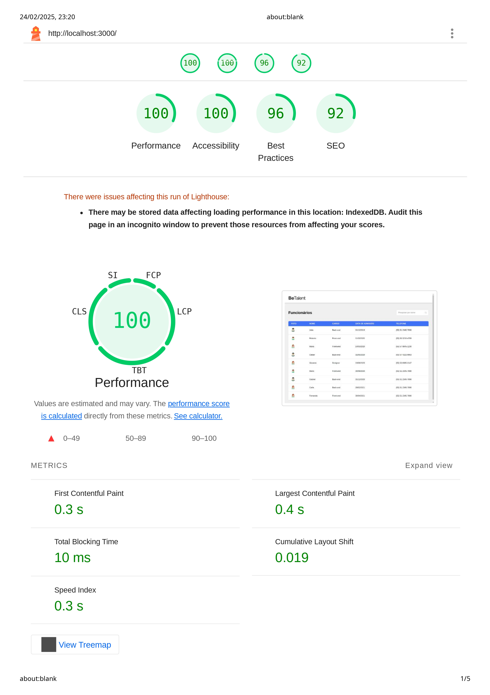

# BeMobile Teste Prático Frontend

Bem-vindo ao projeto BeMobile Teste Prático Frontend. Este repositório contém a aplicação frontend desenvolvida no contexto de um desafio prático, demonstrando técnicas modernas de desenvolvimento web, design responsivo e integração fluida com serviços de backend.

## Índice

- [Visão Geral](#visão-geral)
- [Funcionalidades](#funcionalidades)
- [Tecnologias Utilizadas](#tecnologias-utilizadas)
- [Instalação](#instalação)
- [Uso](#uso)
- [Estrutura do Projeto](#estrutura-do-projeto)
- [Contribuições](#contribuições)
- [Teste de performance](#teste-de-performance)

## Visão Geral

O projeto BeMobile Teste Prático Frontend foi desenvolvido para demonstrar habilidades em desenvolvimento frontend, com foco em boas práticas como arquitetura baseada em componentes, gerenciamento de estado e interfaces de usuário responsivas. Esta base de código foi concebida para um desafio técnico e apresenta um design limpo, escalável e de fácil manutenção, podendo ser expandido para novas funcionalidades.

## Funcionalidades

- **Design Responsivo:** Layouts adaptáveis que garantem uma experiência de uso otimizada em desktops, tablets e dispositivos móveis.
- **Framework Moderno:** Utiliza frameworks e bibliotecas atualizadas para a construção de interfaces interativas e gerenciamento do estado da aplicação.
- **Integração com APIs:** Comunicação eficiente com APIs de backend para buscar e exibir dados dinâmicos.
- **Estrutura Modular:** Organização do código para facilitar a manutenção e a escalabilidade do projeto.
- **Testes Automatizados:** Inclusão de testes essenciais para garantir a estabilidade e o funcionamento dos componentes e da aplicação.

## Tecnologias Utilizadas

- **Framework:** React.js
- **Gerenciamento de Estado:** React Context 
- **Estilização:** CSS
- **Controle de Versão:** Git

## Instalação

Para rodar o projeto localmente, siga os passos abaixo:

1. **Clone o Repositório:**

   ```bash
   git clone https://github.com/joaoroche/BeMobile-teste-pratico-frontend.git
   ```

2. **Acesse o Diretório:**

   ```bash
   cd BeMobile-teste-pratico-frontend
   ```

3. **Instale as Dependências:**
   ```bash
   npm install
   ```
   ou
   ```bash
    yarn install
    ```

## Uso
Para iniciar o servidor de desenvolvimento, execute:
```bash
npm run start:front:and:back
```
ou
```bash
   yarn start:front:and:back
```

Se você preferir rodar o servidor de backend separadamente, execute:
```bash
npm run server
```
ou
```bash
yarn server
```
E, em seguida, execute:
```bash
npm run start
```
ou
```bash
yarn start
```

Se tudo ocorrer bem, a aplicação estará disponível em http://localhost:3000.

A aplicação será aberta automaticamente no navegador padrão. Se ocorrerem modificações no código, a página será recarregada automaticamente.

Para criar uma build para produção, utilize:

```bash
npm run build
```
ou
```bash
yarn build
```

Consulte os scripts definidos no package.json para outras funcionalidades disponíveis.

## Estrutura do Projeto
A estrutura básica do projeto está organizada da seguinte forma:
├── public/           # Arquivos estáticos, como imagens, fontes e o arquivo index.html
├── src/              # Código fonte principal
│   ├── components/   # Componentes de interface reutilizáveis
│   ├── hooks.js      # Hooks personalizados
│   ├── pages/        # Componentes de páginas para as diferentes rotas
│   ├── services/     # Módulos de serviços e utilitários para interações com APIs
│   ├── App/          # Componente principal da aplicação (React Router)
│   └── utils/        # Funções auxiliares e utilitários
├── package.json      # Dependências e scripts do projeto
└── README.md         # Documentação do projeto (este arquivo)

## Contribuições
Contribuições e sugestões são bem-vindas!

1. Faça um fork do repositório.
2. Crie uma branch para a sua feature ou correção de bug: `git checkout -b feat/minha-feature`.
3. Faça commit das suas alterações: `git commit -m 'feat: adiciona nova feature'`.
4. Envie suas alterações para o repositório remoto: `git push origin feat/minha-feature`.

Por favor, siga o padrão de código existente e inclua testes quando necessário.

## Teste de performance


